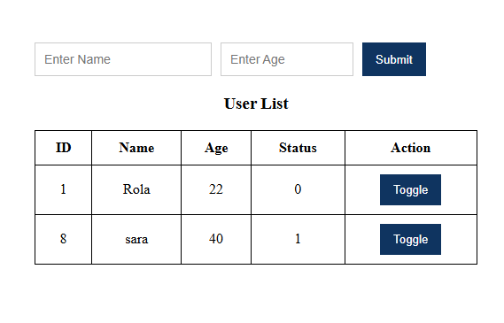

#  User Management 

This is a simple PHP web app that allows you to add users (name and age), display them in a table, and toggle their status (active = 1 / inactive = 0).

# Project Interface

# Technologies Used

- PHP
- MySQL (via phpMyAdmin)
- HTML & CSS
- XAMPP (for local server)

#Features

- Input form for name and age
- Displays all users in a clean table
- Button to toggle user status (0 or 1)
- Responsive and minimal layout using plain CSS
- Uses PHP and MySQL via phpMyAdmin

